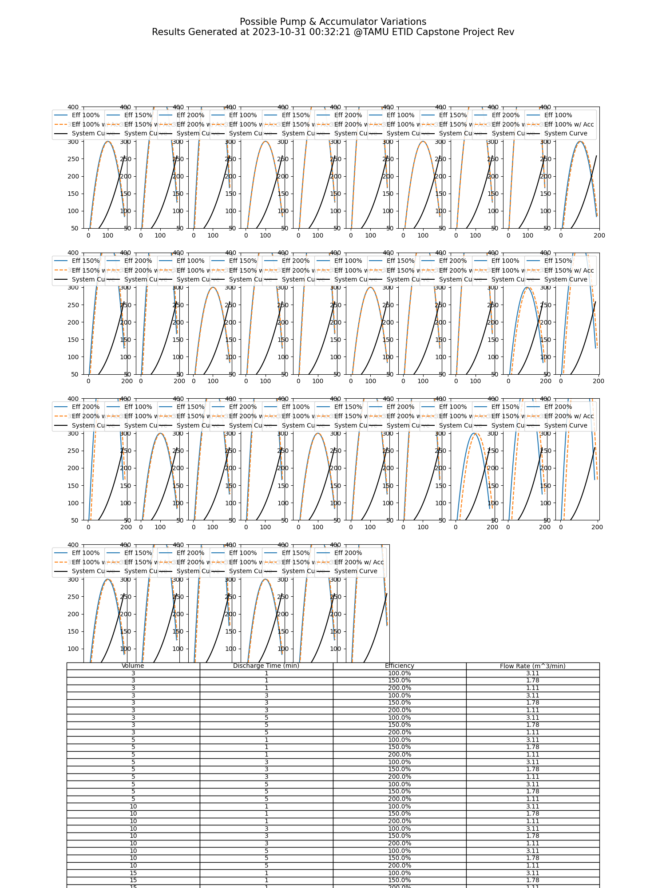

# Enhanced Cycle Time Reduction in Hydraulic Systems

## Overview
This repository contains a study on the interaction between pump curves and system curves within hydraulic systems, and the impact of accumulators on flushing cycle times. The integration of an accumulator is expected to improve operational efficiency by allowing for a higher flow rate, thus reducing cycle times and enhancing overall system performance.  
Example output:  

## Introduction
In various industrial applications, the efficiency of hydraulic systems is often determined by the relationship between the pump performance (pump curves) and the system resistance (system curves). This project explores the hypothesis that using an accumulator can lead to significant improvements in cycle times, offering a detailed analysis supported by mathematical models and simulations.

## Methodology
The investigation involves modeling pump and system curves with a focus on the mathematical relationships between flow rate and head. The key equations used in the study are:

- Pump Curve Equation:
where `H` is the head, `H_max` is the maximum head, `Q` is the flow rate, and `Q_max` is the maximum flow rate.

- System Curve Equation:
where `h0` is the static head and `k` is the system loss coefficient.

- Adjusting Flow Rate for Accumulator Effect:
where `ΔQ_accumulator` is the flow rate increase due to the accumulator.

## Results
The simulation results show the intersections between the pump and system curves, with and without the accumulator. These intersections dictate the operational points that directly influence the system's flushing cycle times.  
An accumulator in the hydraulic system leads to a noticeable shift in the pump curves, demonstrating the potential for cycle time reduction. This shift points towards a greater flow rate that can significantly reduce the time required for flushing cycles, implying enhanced system efficiency and throughput.
The findings of this project support the hypothesis that accumulators can play a crucial role in optimizing hydraulic systems, particularly where reduced cycle times are beneficial.  

## How to Use This Repository
- Clone the repository to get the simulation code and datasets.
- Follow the instructions in the simulation scripts to adjust parameters and run simulations.
- View the `plots` folder for pre-calculated outcomes or generate new data as needed.

## License
This project is licensed under the [MIT License](LICENSE).

## Acknowledgements
We would like to thank the University and Tenaris for sponsoring this project.
