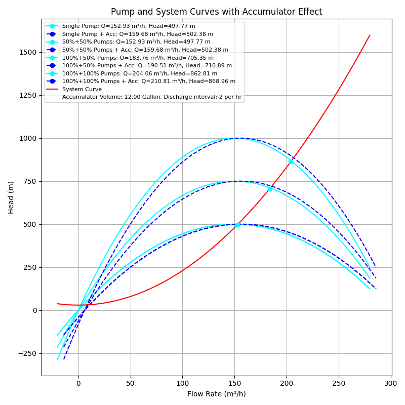

# Enhanced Cycle Time Reduction in Hydraulic Systems

## Overview
This repository contains a study on the interaction between pump curves and system curves within hydraulic systems, and the impact of accumulators on flushing cycle times. The integration of an accumulator is expected to improve operational efficiency by allowing for a higher flow rate, thus reducing cycle times and enhancing overall system performance.  
In various industrial applications, the efficiency of hydraulic systems is often determined by the relationship between the pump performance (pump curves) and the system resistance (system curves). This project explores the hypothesis that using an accumulator can lead to significant improvements in cycle times, offering a detailed analysis supported by mathematical models and simulations.

## Methodology
The investigation involves modeling pump and system curves with a focus on the mathematical relationships between flow rate and head. The key equations used in the study are:

- **ump Curve Equation:**  
  `H = H_max * (1 - (Q/Q_max)^2)`
  
- **System Curve Equation:**  
  `h = h0 + k * Q^2`
  
- **Adjusting Flow Rate for Accumulator Effect:**  
  `Q_new = Q_original + ΔQ_accumulator`

- **Continuity Equation (Conservation of Mass):**  
  `A1 * v1 = A2 * v2`  
  Where `A` is the cross-sectional area and `v` is the fluid velocity at points 1 and 2 in a pipeline.

- **Bernoulli’s Equation (Conservation of Energy):**  
  `P1/γ + v1²/2g + z1 = P2/γ + v2²/2g + z2 + hL`  
  Where `P` is the pressure, `γ` is the specific weight of the fluid, `v` is the fluid velocity, `g` is the acceleration due to gravity, `z` is the elevation head, and `hL` is the head loss between points 1 and 2.

- **Torricelli’s Law:**  
  `v = √(2gh)`  
  Where `v` is the velocity of the fluid flowing from an orifice, `g` is the acceleration due to gravity, and `h` is the height of the fluid above the orifice.

- **Darcy-Weisbach Equation (Head Loss due to Friction):**  
  `hL = f * (L/D) * (v²/2g)`  
  Where `hL` is the head loss, `f` is the Darcy friction factor, `L` is the length of the pipe, `D` is the diameter of the pipe, `v` is the flow velocity, and `g` is the acceleration due to gravity.

- **Accumulator Charge/Discharge Equation:**  
  `P1 * V1^n = P2 * V2^n`  
  Where `P1` and `P2` are the initial and final pressures, `V1` and `V2` are the initial and final volumes, and `n` is the polytropic exponent for the compression/expansion process.

These equations are fundamental to understanding and predicting the behavior of hydraulic systems under various operational conditions. The integration of accumulators and analysis of system dynamics require a thorough application of these principles.

## Results
The simulation results show the intersections between the pump and system curves, with and without the accumulator. These intersections dictate the operational points that directly influence the system's flushing cycle times.

#### Example output (single):  
  

#### Example output (cluster):  

An accumulator in the hydraulic system leads to a noticeable shift in the pump curves, demonstrating the potential for cycle time reduction. This shift points towards a greater flow rate that can significantly reduce the time required for flushing cycles, implying enhanced system efficiency and throughput.

The findings of this project support the hypothesis that accumulators can play a crucial role in optimizing hydraulic systems, particularly where reduced cycle times are beneficial.

## Web Scraper Integration
To further support this study, a web scraper has been developed to aggregate product data related to hydraulic accumulators from various online sources. The scraper extracts the name, URL, and price of products, and saves the formatted HTML to a separate file.

### INFO
- The scrapper is still WIP and only for demonstration purposes. 

### Scraper Output
The scraper outputs a JSON file containing the aggregated product data which can be found at [sample output json](web/product_data.json)

## How to Use This Repository
- Clone the repository to get the simulation code and datasets.
- Follow the instructions in the simulation scripts to adjust parameters and run simulations.
- View the `plots` folder for pre-calculated outcomes or generate new data as needed.

## License
This project is licensed under the [MIT License](LICENSE).

## Acknowledgements
We would like to thank the University and Tenaris for sponsoring this project.
